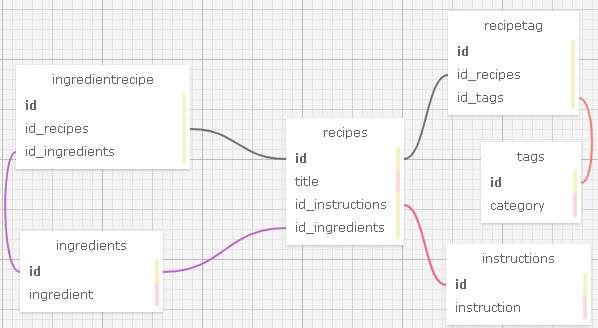

<br>
<p align="center">
  <b style="margin-left: 1rem; margin-right: 1rem; font-size: 5em">Recipe Book</b>
</p>

<p align="center">
    <br>
    <a href="https://github.com/Harzulu">
        
    </a>
    <a href="https://github.com/SJerrod">
        
    </a>
</p>

<p align="center">
  <small>Last Updated: January 11th, 2021</small>
</p>

# ℹ️ Description

A MVC web app to help you keep track of recipes. Users can input recipes, ingredients and modify exiting entries.

# 🧑‍💻 Contributers

| Name | GitHub Profile |
|------|----------------|
|[Ben McFarland](https://www.linkedin.com/in/benjamin-mcf/)|[Harzulu](https://github.com/harzulu)|
|[Jerrod Styrk](https://www.linkedin.com/in/styrk-jerrodm/)|[SJerrod](https://github.com/SJerrod)|

# 📗 User Stories

<details>
  <summary>Click to View</summary>
  
  <table>
  <tr>
    <th>Scenario 01</th>
    <th></th>
  </tr>
  <tr>
    <td>Behavior</td>
    <td>As the factory manager, I need to be able to see a list of all engineers, and I need to be able to see a list of all machines.</td>
  </tr>
  <tr>
    <td>Input</td>
    <td>Click on "Engineers" or "Machines" link</td>
  </tr>
  <tr>
    <td>Output</td>
    <td>Display page with list of names being links to all engineers or machines</td>
  </tr>
  <tr>
    <td>Completion</td>
    <td>✅</td>
  </tr>
</table>

<table>
  <tr>
    <th>Scenario 02</th>
    <th></th>
  </tr>
  <tr>
    <td>Behavior</td>
    <td>As the factory manager, I need to be able to select a engineer, see their details, and see a list of all machines that engineer is licensed to repair. I also need to be able to select a machine, see its details, and see a list of all engineers licensed to repair it.</td>
  </tr>
  <tr>
    <td>Input</td>
    <td>Click link of specific engineer or machine</td>
  </tr>
  <tr>
    <td>Output</td>
    <td>Display page with all given engineer or machine info and all connected engineers/machines</td>
  </tr>
  <tr>
    <td>Completion</td>
    <td>✅</td>
  </tr>
</table>
</details>

# 📊 SQL Schema

<center>
    
</center>

# ⚙️ Technologies Used

<details>
  <summary>Expand Tech/tools</summary>

* <a href="https://code.visualstudio.com/">Microsoft Visual Studio Code</a>
* <a href="https://github.com/">Git/GitHub</a>
* <a href="https://docs.microsoft.com/en-us/dotnet/csharp/">C#</a>
* <a href="https://dotnet.microsoft.com/download">.NET Core</a>
* <a href="https://repl.it/languages/csharp">REPL</a>
* <a href="https://docs.microsoft.com/en-us/aspnet/web-pages/overview/getting-started/introducing-razor-syntax-c">APS.NET Razor</a>
* <a href="https://docs.microsoft.com/en-us/aspnet/mvc/overview/getting-started/introduction/getting-started">ASP.NET MVC</a>
* <a href="https://developer.mozilla.org/en-US/docs/Learn/CSS">CSS</a>
* <a href="https://getbootstrap.com/">Bootstrap</a>
* <a href="https://docs.microsoft.com/en-us/ef/core/">EF Core</a>
* <a href="https://www.mysql.com/">MySQL/My SQL Workbench</a>
* <a href="https://ondras.zarovi.cz/sql/demo/">MySQL Designer</a>

</details>

# 💾 Installation Requirements

## For Both  Mac & Windows systems

* Once you have Git installed on your computer, go to <a href="https://github.com/harzulu/Factory.Solution">this GitHub repository</a>, click the "Fork" button in the upper right hand corner of the page, and clone this application with the following command:
<br> `git clone https://github.com/harzulu/Factory.Solution`.

## 📁 Installing C#, .NET, dotnet script, & MySQL

### **This program requires C# and the .NET Framework to be installed on your machine:**

## For Mac 
 * Download <a href="https://dotnet.microsoft.com/download/thank-you/dotnet-sdk-2.2.106-macos-x64-installer">this</a> .NET Core SDK (Software Development Kit). Clicking this link will prompt a .pkg file download from Microsoft.
* Open the .pkg file. This will launch an installer which will walk you through installation steps. Use the default settings the installer suggests.
* Confirm the installation is successful by opening your terminal and running the command `$ dotnet --version`, which should return something like: `2.2.105`. 

## For Windows (10+)

* Download <a href="https://dotnet.microsoft.com/download/thank-you/dotnet-sdk-2.2.203-windows-x64-installer">this</a> 64-bit .NET Core SDK (Software Development Kit). Clicking these links will prompt a .exe file download from Microsoft.
* Open the file and follow the steps provided by the installer for your OS.
* Confirm the installation is successful by opening a new Windows PowerShell window and running the command `dotnet --version`. You should see something a response like this: `2.2.105`.

## For Mac & Windows Operating Systems

* Install dotnet script with the following terminal command:
<br> `dotnet tool install -g dotnet-script`.

# 🖥️ Opening the Project on your Local System

* Once the project has been cloned to your computer and you have all the necessary items on your local computer, open the project in the application of your choice (<a href="https://code.visualstudio.com/">Visual Code Studio</a> was used and is recommended by the application builder)

### AppSettings.json File

You will need to create an `appsettings.json` file in the `Factory` folder. <br>
Once you have the file made, put in this code: <br>
```
{
  "ConnectionStrings": {
    "DefaultConnection": "Server=localhost;Port=3306;database=first_last;uid=root;pwd=PASSWORD;"
  }
}
```
**Make sure to have a MySQL server up and running on your machine on port 3306** <br>
**Replace `PASSWORD` with the password to your server created for this project**

### MySQL Database Setup

* First, using your terminal or command line, navgate to the HotelCRM folder in HotelCRM.Solution: `/Factory.Soulution/Factory`.
* Next, run the command: `dotnet ef database update`.
* You should have your database created for this project.

### Opening The Project
* Finally, run the command `dotnet build` to get bin/ and obj/ folders downloaded, then `dotnet run` to run the application. The program should be connected to a localhost port, most likely 5000. Your terminal or command line should specify which port it is on.
* Type into your web browser `http://localhost:[PORT_NUMBER]/` to view the project.


# ☎️ Support / Contact Details

* Ben McFarland benrmcfarland@gmail.com
* Jerrod Styrk jstyrk@citadel.edu

# 🪲 Bugs / Issues

No known bugs or issues

# ©️ License & Copyright

[](https://opensource.org/licenses/MIT)

Copyright (c) 2021 *_Ben McFarland_, _Jerrod Styrk_*